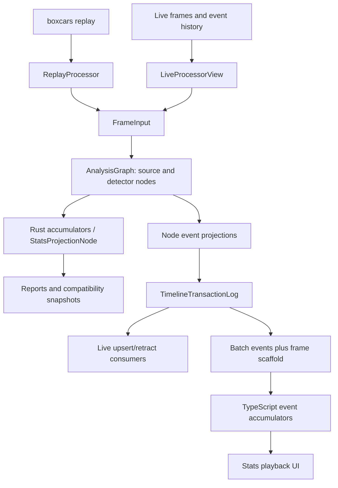

# Architecture review — September 2026

## Assessment

The useful organizing principle is already present: normalize source data,
detect domain observations, and project observations into reports. Preserve
that separation. The main cleanup opportunity is making ownership of
projection semantics and analysis-session lifecycle explicit across consumers.

This review inspected the graph runtime, frame sampling, timeline collectors,
transaction log, live server/consumer, and representative browser loading and
stat-derivation code. It is a source-level review, not an exhaustive audit of
detector accuracy, the Windows ABI, or every UI module. Performance findings describe work visible in the implementation. The graph
traversal microbenchmark below measures dispatch overhead only, not complete
replay-processing throughput.

## Current architecture

The graph is a good dependency boundary. Calculators can share touch,
possession, and live-play state without independently rediscovering it. The
event log provides explicit revision and finalization semantics. Compact
playback separates transfer size from the much larger full-snapshot format.
These are valuable constraints to keep during refactoring.

## Changes reviewed on September 5–6, 2026

- **Graph invalidation:** declaring a root/input provider after `resolve()`
  previously left its cache valid. A conflicting node could then silently
  override the supplied value during evaluation. New declarations now
  invalidate resolution; replacing an already registered root value does not.
  Regression tests cover late root/input conflicts and ordinary root updates.
- **Sampling termination:** repeatedly adding a positive `f32` interval could
  fail to advance a large timestamp, hanging the collector. Large time gaps
  also required one iteration per missed interval. Sampling now computes the
  next boundary in constant time with wider arithmetic and ensures that the
  stored boundary advances. Tests cover sub-precision intervals, skipped
  intervals, tolerance boundaries, and invalid-step fallback. The first boundary
  also advances past the current timestamp, avoiding a duplicate zero-duration
  sample when the interval is smaller than timestamp precision. For custom
  intervals near the input frame duration, wider arithmetic can shift emission
  decisions at floating-point boundaries relative to repeated `f32` addition.
- **Redundant ordering state:** resolution already physically sorts the node
  vector. Removed the second vector containing `0..nodes.len()` and its
  per-evaluation clone; evaluation, finish, and projection traverse that order
  directly.
- **Graph traversal:** evaluation, finish, and projection now build one state
  context and extend it with each completed node. This preserves preceding-node
  visibility and input/root precedence while replacing quadratic context-map
  population with linear work. A release-mode synthetic chain of 80 typed nodes
  over 5,000 frames measured 444–452 ms before and 25–26 ms after (three runs
  each, same temporary benchmark crate/toolchain). This is roughly 17x faster
  graph dispatch in that workload, not a replay-wide speedup claim.
- **Default dependency resolution:** required states are checked after default
  dependency discovery, so another node's transitive default can satisfy them.
  Factories that return an unrelated state now fail before inserting that
  provider, with the expected and actual types in the error.
- **Documentation drift:** corrected nonexistent reducer and collector paths
  and documented the event log, compact playback, and compatibility collector
  in the runtime guide and repository instructions.

## Priority 1: define a live analysis session explicitly

Evidence:

- [Consumer store](../crates/subtr-actor-live-consumer/src/store.rs): sequence
  decreases reset state, but `MatchStart` only updates metadata. A snapshot
  replaces event history and retains the previous latest frame when its
  `latest_frame` is absent; a unit test explicitly encodes that behavior.
- [Consumer driver](../crates/subtr-actor-live-consumer/src/driver.rs):
  `MatchStart` synchronizes metadata without resetting the graph. Snapshots do
  not replay missed frames through detectors.
- [Server subscription](../crates/subtr-actor-live/src/server/mod.rs): every
  connection gets `MatchStart` if a match is active, including reconnects to the
  same match. Sequence numbers keep increasing across matches.
- [Streaming example](../crates/subtr-actor-live-consumer/examples/event_timeline_stream.rs):
  the store and graph survive ordinary disconnect/reconnect cycles.

Consequently, disconnecting during match A and reconnecting during match B can
carry A's detector state into B if `MatchEnd` was missed. Sequence decrease
detection cannot identify this on a server that stayed running. Conversely,
resetting on every `MatchStart` would discard useful state on same-match
reconnects. A snapshot of low-level event history cannot reconstruct all
missed motion samples or detector candidates.

Proposed contract: expose a server-session ID and match ID in the live
protocol. A driver explicitly begins, resumes, or ends an analysis session.
Choose whether a gap produces partial analysis, starts a fresh analysis epoch,
or restores a sufficient checkpoint. Include that completeness in output.
Version this change according to JSON/postcard compatibility rules.

Acceptance cases: reconnect within a match; reconnect after a missed match end;
server restart with a sequence larger than the client's last observed value;
empty snapshot after an old frame; and reconnect after missed detector input.
Do not silently label resumed output as complete.

## Priority 1: distinguish detector input cadence from output cadence

The [live server](../crates/subtr-actor-live/src/server/mod.rs) supports
`max_frame_hz` by dropping event-free frames for a subscriber. The
[driver](../crates/subtr-actor-live-consumer/src/driver.rs) evaluates the full
analysis graph only on received frames and uses the payload's original `dt`.
The streaming example exposes this option directly.

Preserving low-level event-bearing frames does not preserve motion-derived
evidence: carry continuity, peak acceleration, and time-weighted samples can
depend on frames with no low-level events. Increasing `dt` across a gap can
correct some integrals but cannot recover missing physics.

Make full input delivery a requirement of exact analysis. Keep output
projection/snapshot rates configurable independently. If lossy analysis is a
supported product, report its input coverage and test its limitations
explicitly. A useful test compares an uninterrupted synthetic carry or motion
span against a throttled stream and verifies that the latter cannot claim
equivalent coverage.

## Priority 2: give report accumulation one semantic owner

[Rust flick accumulation](../src/stats/accumulators/flick.rs) and
[TypeScript flick derivation](../js/stat-evaluation-player/src/flickEventDerivation.ts)
both implement confidence bands, labeled counts, sums, and last-event state.
The TypeScript implementation even emulates Rust `f32` arithmetic. Similar
per-stat derivation modules exist throughout the UI. This is domain behavior,
so generated type declarations alone cannot prevent semantic drift.

The legacy export gap exposed another duplicate semantic owner. On untouched
baseline `29246acf`, the ignored sampled collector parity test found 10,358
reconstructed events versus 10,432 canonical graph events. A per-stream probe
confirmed all 74 missing events were `loose_possession`. It also found different
IDs throughout the reconstruction and missing goal-context tags, including
`flip_into_ball_goal`.

The follow-up removes the handwritten event reconstruction and its private JSON
parsers. Both collectors now use the same reduced graph transaction log, and
`CapturedStatsData` carries those typed events through all legacy conversions.
This preserves canonical IDs, ordering, lifecycle, properties, and payloads
without a second mapping of modules to streams. Normal CI now exercises clip
parity at every-frame and sampled resolutions plus snapshot conversion coverage.

Compatibility: `CapturedStatsData` has a new required Rust field, `events:
ReplayStatsTimelineEvents`. External struct literals must supply it; use the
collector APIs to obtain canonical events, or an empty default only when the
capture intentionally has no events. Its serialized JSON gains an `events` key.
Legacy event IDs now match graph IDs, and missing streams and tags are restored.
Selected-module captures retain only selected module reports, but their events
include streams emitted by transitive graph dependencies. Captures before replay
completion project current events with their interim lifecycles; completed
captures reuse the finalized log. The selection test
makes that behavior explicit. Consumers that enforce an exact capture JSON
schema or persist legacy IDs need to account for these changes.

Once event parity was restored, the full-replay test reached another old snapshot
omission: `CorePlayerStatsSnapshot` dropped
`caught_ahead_of_play_on_conceded_goals`. The field is now copied through and has
a focused serialization round-trip test. The remaining manually listed core
snapshot fields are another candidate for replacing duplication with a flattened
canonical base plus explicitly computed compatibility fields.

The existing
[legacy parity test](../js/stat-evaluation-player/src/statsTimelineLegacyParity.slow-test.ts)
is an important migration safeguard. Keep it. First establish focused parity
fixtures for event sequences, including simultaneous events, non-live samples,
and finalization. Then prototype one Rust accumulator exposed through WASM
over compact events, measuring startup, seek latency, and memory against the
current JS implementation. If WASM call overhead or deployment requirements
make this unattractive, generate the simple accumulator operations from a
shared declarative specification instead.

Keep presentation in TypeScript. Move projection ownership only after the
prototype preserves playback behavior and performance. Preserve the legacy
collector until compatibility callers and parity coverage have replacements.

## Priority 2: consolidate session driving before splitting crates

[AnalysisNodeCollector](../src/stats/analysis_graph/collector.rs),
[timeline collectors](../src/stats/timeline/collector.rs), and
[report collection](../src/collector/stats/collector.rs) independently handle
metadata initialization and frame driving. Metadata refresh is keyed to player
count. The live driver instead compares a roster signature. BakkesMod has its
own live metadata and graph lifecycle state.

Player count is not a general metadata revision: a same-size roster replacement,
team change, or name update does not change it. Whether each case occurs in a
particular replay path needs fixture verification; the live/replay contracts
are visibly different today.

Introduce an internal analysis-session driver owning graph initialization,
metadata revision, evaluation, projection cadence, and finalization. Collectors
should select outputs and persistence cadence; source adapters should select
how input is sampled. Start by sharing replay-only lifecycle code, with
unchanged public collector APIs. Bring live callers across after session/gap
semantics are defined. Do not force replay interpolation and live-host state
behind identical acquisition policies.

Acceptance cases: same-size roster changes, repeated finish, zero-frame input,
metadata updates after evaluation, backward time, and errors during finish.

## Priority 2: make graph execution cost match its dependency model

The single-context traversal implemented in this pass removes the main
quadratic map-building cost without adding indexed slots or unsafe code.
`required_input_states()` still rebuilds dependency vectors each frame. Caching
that list requires deciding whether custom nodes may change dependencies during
metadata updates or evaluation; preserve the current behavior until the static
contract is explicit. Topological order and default expansion are already
cached, so dynamically changing dependencies can currently produce stale
ordering even though required-input checks refresh. Define one coherent
dependency lifecycle before caching further. The public `state()` lookup also
remains linear; measure remaining overhead before optimizing it.

Also define provider precedence explicitly. Root and input declarations can
overlap, and supplied input values are not restricted to declared input types.
`from_parts` overwrites earlier values while `state()` prefers roots. The fix
in this pass closes late declaration conflicts with nodes; it does not change
these existing precedence rules. Add contract tests before tightening them.

## Priority 3: bound event projection and retention costs

Each [node projection](../src/stats/analysis_graph/nodes/flick.rs) revisits its
full event history. The [transaction log](../src/stats/timeline/transaction_log.rs)
compares the full projection, stores current events, and retains all historical
transactions. Projecting once per second reduces the constant factor but still
revisits old events as a match grows. An open span can also retain many payload
versions in the transaction history.

Separate immutable finalized history from the bounded set of revisable events.
A producer cursor plus updates for revisable IDs can make projection work
proportional to new/changed events. Add transaction retention only with a clear
checkpoint/resume contract; silently truncating an append-only log would break
existing consumer cursors. Preserve cadence-independent IDs and finish-time
finalization throughout the migration.

The log currently selects invariant policy from `debug_assertions`. Consider
an explicit driver policy so release diagnostics can be strict and tests can
exercise production tolerance. Its documentation also says the crate has no
logging facade, although `log` is already used elsewhere; route diagnostics
consistently when touching this API.

## Priority 3: simplify binding and browser-loading maintenance

- [Player package scripts](../js/player/package.json) and
  [stats package scripts](../js/stat-evaluation-player/package.json) embed long
  binding-generation shell programs. Extract a shared runner with explicit
  export targets, temporary-directory generation, and exact output comparison.
  Current verification regenerates into tracked directories, so a failing
  verification can leave changes in the worktree.
- [Main-thread loading](../js/player/src/wasm.ts) and
  [worker loading](../js/player/src/wasm.worker.ts) duplicate wire message types,
  validation shapes, and Map-to-object conversion. A shared protocol module is
  a straightforward cleanup. Keep worker-specific globals out of shared code.
- Worker loading serializes normalized replay data to JSON, then parses it on
  the main thread; raw data is also parsed in both places. Profile transfer,
  parse cost, and peak memory before changing the format. Transferable columnar
  buffers are a possible later improvement, not a reason to rewrite the player
  immediately.

## Suggested implementation order

1. Land the bounded graph/sampling fixes and corrected runtime map.
2. Add live session identity and input-coverage tests; settle resume semantics.
3. Extract the shared session driver without changing collector outputs.
4. Prototype one authoritative event accumulator across Rust and browser paths.
5. Optimize graph lookup and event projection using measurements and parity tests.
6. Extract binding scripts and browser protocol helpers independently.

Avoid a blanket module rename or public crate split before these contracts are
clear. Moving files would leave the same duplicated semantics behind more API
boundaries.

## Independent review

Fable 5.1 reviewed the changes through Paseo at high effort. It found no blocking
defects, confirmed traversal visibility and dependency resolution, and identified
the first-boundary duplicate corrected above. Its follow-up approved that fix
and agreed to defer dependency caching until the contract is explicit. In the
next pass it recommended canonical captured events, reviewed the deletions, and
identified the pre-finish capture gap. A private collector flag now permits
interim projection while protecting finalized events from lifecycle downgrade;
Fable approved that correction and the caught-ahead snapshot fix, and checked
that both manual core snapshots now cover all typed serialized fields. It also
compared sampling against
the old loop: intervals 0.1, 0.25, 0.5, 1.0, and 2.0 matched in its jittered-frame
experiment; sub-frame custom intervals can differ at rounding boundaries.

Caching required input types was considered and deferred: the public node trait
does not currently document dependencies as immutable across evaluations or
metadata changes. The single-context improvement preserves those existing calls.

## Validation of this pass

- `just check` passed: release consistency, Rust formatting, locked metadata,
  workspace/all-target/all-feature Clippy, README synchronization, JS style,
  and threat-model lock/lint/format checks.
- `cargo test -p subtr-actor --lib stats::analysis_graph::graph::tests`:
  19 passed, including late-provider and transitive-default regressions that
  failed before their fixes.
- `cargo test -p subtr-actor --lib collector::frame_resolution::tests`:
  6 passed.
- The explicitly enabled `interim_event_projection_matches_finish_only_on_real_replay`
  test passed, comparing final event sets with and without interim projection.
- `cargo test -p subtr-actor --test post_eac_replay_fixture_test`: 5 passed,
  5 broad/slow cases remained ignored.
- The three non-ignored `stats_frame_resolution_test` tests passed: clip event
  and frame parity at two resolutions, snapshot conversion/selection behavior,
  and pre-finish interim capture. Three collector unit tests also passed,
  including the core snapshot regression.
- The explicitly enabled full-replay sampled collector parity test now passes
  in release mode (18 seconds), including all 10,432 events and sampled frames.
  The debug run first exposed the missing caught-ahead goal count after event
  comparison passed; the focused debug test verifies that serialization fix.
- `cargo test -p subtr-actor-bakkesmod --no-run` passed.
- Fresh web and Node WASM packages built. The JS `test:legacy-stats-parity`
  check failed on first-frame touch stats: browser hydration omits
  `labeled_action_counts` and `labeled_possession_counts` present in legacy
  snapshots. The relevant Rust accumulator and TypeScript derivation code are
  unchanged in this pass. Fable traced the missing axes to `cb8fbd50` and
  confirmed the helper still excludes the obsolete `labeled_intention_counts`
  name. This pre-existing report-derivation gap remains visible; the test was
  not weakened to hide it.
- The full test suite and Windows runtime smoke tests were not run. No ts-rs
  type, live ABI layout, or JS implementation changed.
